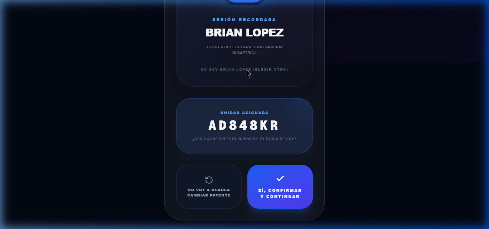
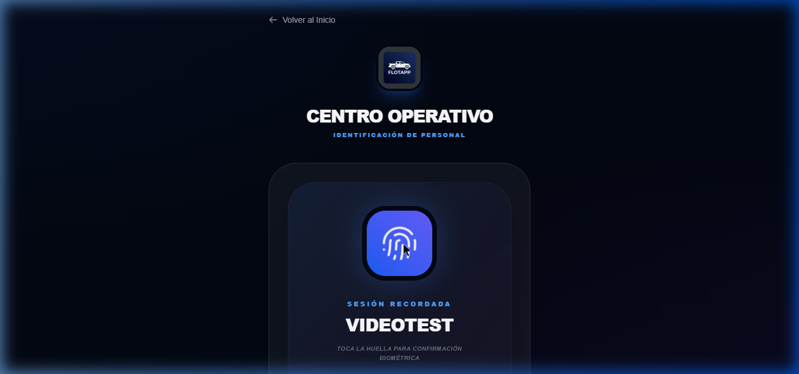
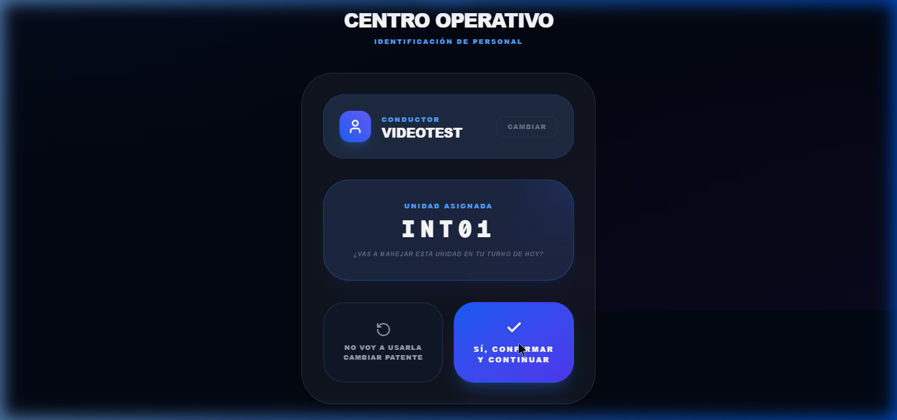
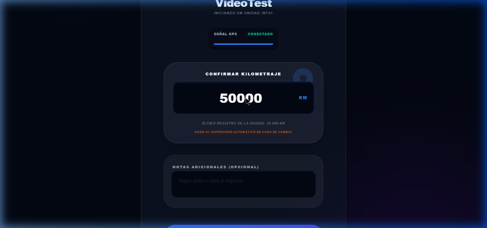
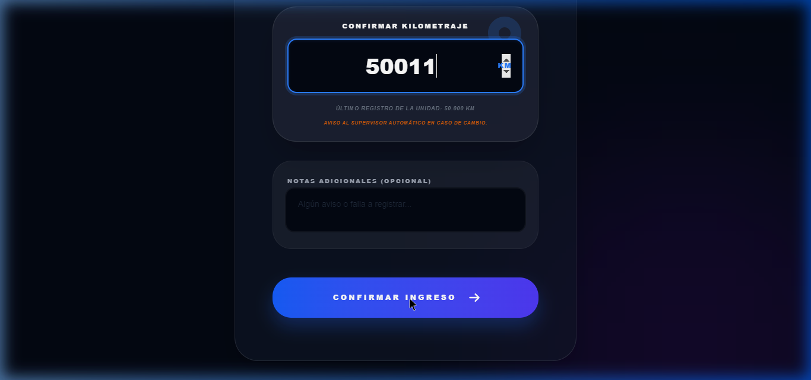
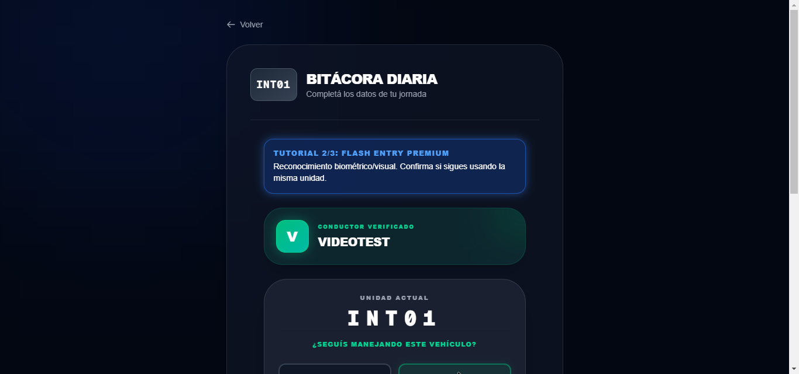
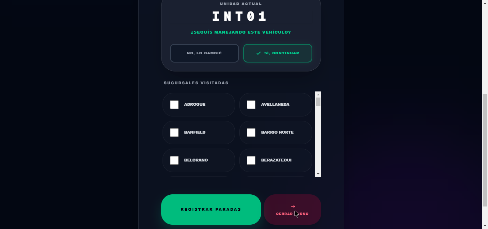
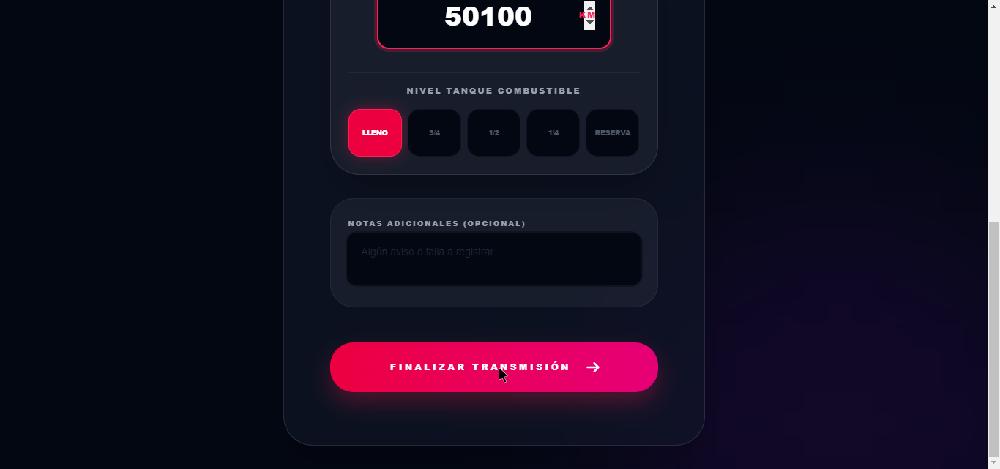

# 🚀 Manual del Chofer Interno - FlotApp

¡Hola equipo! 👋 Bienvenidos a la guía definitiva de **FlotApp**, tu nueva herramienta de bolsillo para gestionar los recorridos diarios. Olvidate de los papeles y las planillas complicadas; armamos esta app para que sea **súper rápida y fácil de usar**, incluso si te quedás sin señal en la ruta. 📡

Aquí te explicamos exactamente **cuándo** y **cómo** usar la app durante tu jornada, desde que llegás a la mañana hasta que te vas a casa. ¡Vamos paso a paso!

---

## 🌅 1. Cómo Ingresar (Tu primera vez en el día)

*¿Cuándo hacerlo? Siempre que quieras usar la aplicación por primera vez o si cambiaste de celular.*

Para arrancar, necesitamos saber quién sos. Es súper simple:
1. En la pantalla de inicio, tocá la tarjeta principal que dice **"Soy Chofer"**.
2. Desplegá la lista y **buscá tu nombre** entre todos los compañeros.
3. ¡Y listo! La próxima vez que entres en el mismo día, el sistema te recordará y solo tendrás que tocar el **ícono de tu Huella Dactilar** para un ingreso rapidísimo de seguridad. ⚡

---

## 🚐 2. Iniciar el Turno (Tu Primer Viaje)

*¿Cuándo hacerlo? A la mañana temprano, apenas te subís a la primera camioneta o auto del día.*

Este es tu arranque oficial. Necesitamos registrar con qué unidad salís y cuántos kilómetros tiene antes de moverse:

1. El sistema te mostrará una lista con todas las unidades. **Seleccioná la patente** del vehículo al que te estás subiendo.
2. Mirá el tablero del vehículo y **escribí el Kilometraje actual** exacto que figura ahí. (No te preocupes, el sistema te muestra cuál fue el último guardado para ayudarte a recordar).
3. Confirmá cómo encontraste el tanque de combustible.
4. Presioná el gran botón verde de **"Confirmar Ingreso"**. ¡A partir de este momento, estás oficialmente en viaje! 🚀

---

## 🔄 3. Segundo, Tercer o Cuarto Viaje (Paradas Intermedias)

*¿Cuándo hacerlo? Si a mitad del día volvés a la base y te cambian de camioneta, o si hacés una parada técnica y el sistema te pide registrar tu continuación.*

¡Acá es donde la app brilla! Si ya arrancaste tu turno a la mañana, **no tenés que volver a cargar todo de cero**. FlotApp se da cuenta que ya estás trabajando y te activa el **"Flujo Flash"**:

1. Entrás a la app y tocás en elegir vehículo de nuevo.
2. ¡Magia! ✨ El sistema ya sabe que estás a mitad de jornada. **No te pedirá el kilometraje** para no hacerte perder tiempo.
3. Solamente confirmá con el botón de continuar y seguís tu ruta al instante en un solo clic. ⏱️

---

## 🏁 4. Cerrar el Turno (¡A casa!)

*¿Cuándo hacerlo? Al final del día, cuando estacionás la unidad por última vez y te retiras de tu jornada laboral.*

Todo lo que empieza, termina. Cerrar tu turno es vital para que queden asentados todos tus kilómetros del día y para avisarle al próximo compañero en qué estado dejas el móvil.

1. En tu panel principal, buscá abajo de todo el botón resaltado para **Cerrar Turno** y pulsalo.
2. Contanos cómo quedó el coche: ingresá el **Kilometraje final** con el que lo estacionaste, el **nivel de Combustible** al retirarte, y el **Lugar de Guarda** (¿Lo dejaste en base o te lo llevaste?).
3. Dale a **"Finalizar Transmisión"** y ¡listo! Tu jornada quedó cerrada perfecta y ya podés descansar. 🛋️

---

> [!TIP]
> **💡 ¿Te quedaste sin datos en la calle?**
> ¡Cero estrés! La aplicación guarda todo en tu teléfono si no hay internet. Seguí registrando tus viajes normalmente, y apenas agarres señal o WiFi, toda tu info se subirá sola en segundo plano. ¡Mágia pura!
