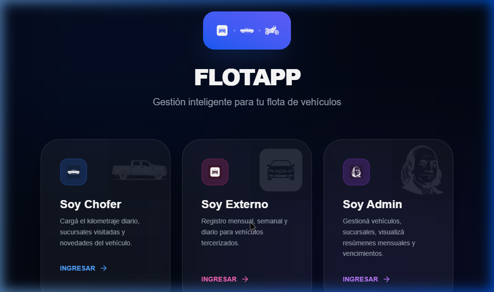
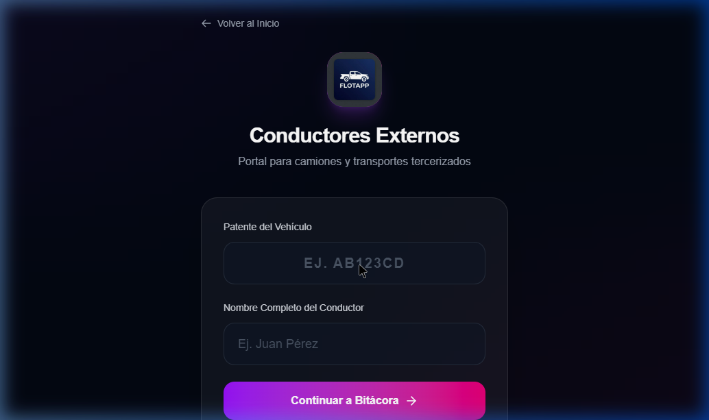
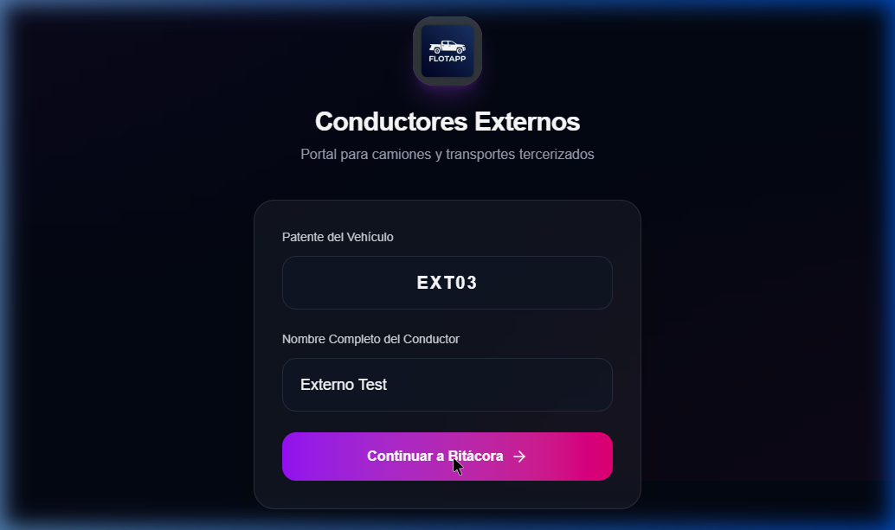
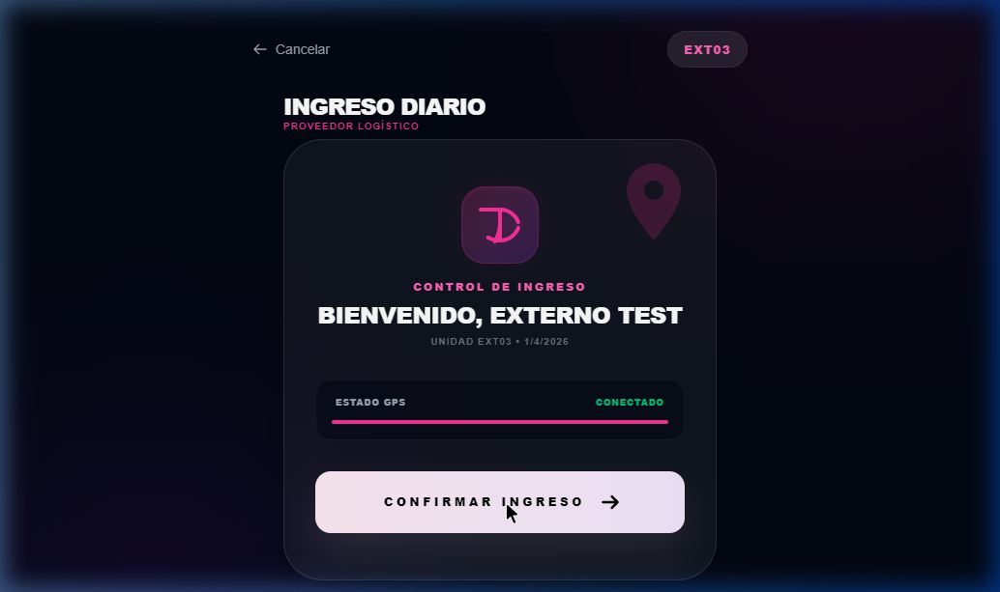
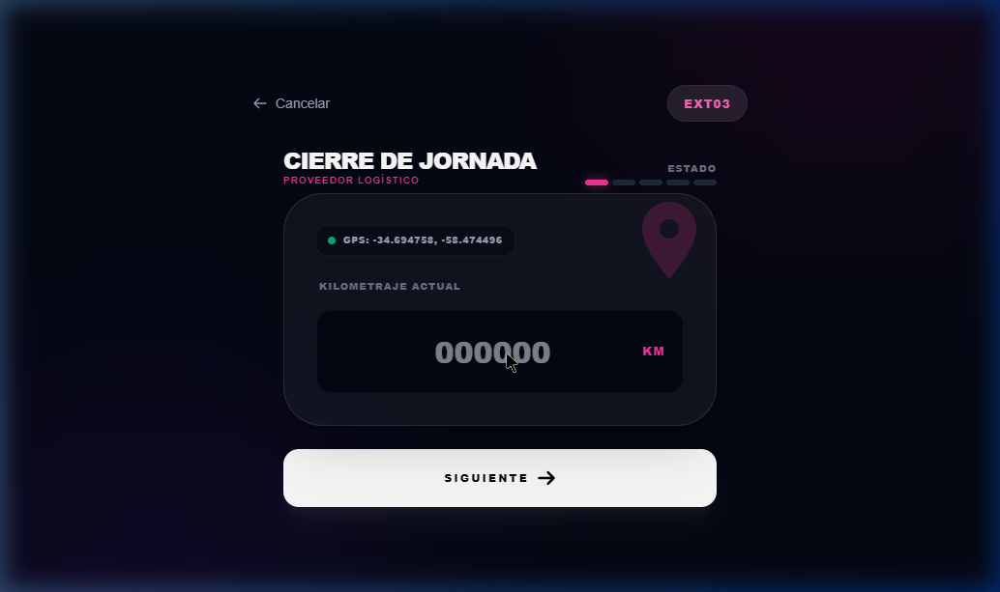
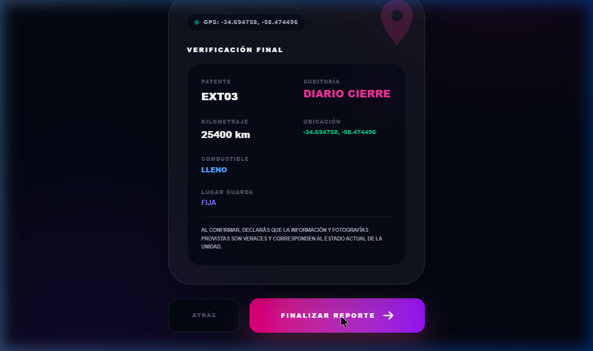

# 🌟 Manual del Proveedor Externo - FlotApp

¡Bienvenidos al equipo! 🤝 Si sos proveedor o conductor externo contratado, esta va a ser tu sala de control. FlotApp fue diseñada para que reportar tu actividad diaria, kilometrajes y auditorías no sea un dolor de cabeza, sino un proceso de unos pocos clics. 

En este manual, súper amigable y al grano, te detallamos **qué hacer en cada momento**.

---

## 🚪 1. Cómo Ingresar a tu Portal

*¿Cuándo hacerlo? Cada vez que necesites interactuar con la plataforma.*

Lo primero es identificarte como parte de la flotilla tercerizada. 

1. En la pantalla principal, seleccioná sin dudar la tarjeta que dice **"Soy Externo"**.
2. Te pedirá tu llave de acceso: tu **Patente**. (Ejemplo: `EXT03`).
3. Presioná **"Continuar a Bitácora"** y serás llevado a tu panel de control personalizado. 📆

---

## 📸 2. La Auditoría Mensual y Semanal

*¿Cuándo hacerlo? Una vez cada mes (Auditoría Completa) y una vez por semana (Auditoría de Kilometraje).*

Para mantener todo legal y en regla, la empresa necesita corroborar el estado de tu coche. ¡Pero no tenés que ir a ningún lado!
- **MENSUALMENTE:** Al ingresar, la app te bloqueará el paso y te pedirá **fotos del vehículo** (Frente, Trasera, Laterales, Tablero) y si es necesario, fotos de la póliza de seguro o VTV renovada. Seguí los pasos de la cámara y envialo.
- **SEMANALMENTE:** A mitad de mes, saltará otra alerta más sencilla, pidiéndote únicamente que anotes el kilómetraje y le saques *una* fotito rápida al tablero. 📸

*Si mantienes estos dos reportes al día, desbloquearás el modo "Ultra-Rápido" para el día a día (Paso 3).*

---

## 🟢 3. Primer Viaje Diario (Check-In de 1 Clic)

*¿Cuándo hacerlo? Todos los días, ¡justo antes de arrancar el motor en tu primer recorrido de la jornada!*

Si sos un conductor aplicado y tus auditorías están al día, empezar a trabajar es un juego de niños:

1. Ingresás a tu Bitácora Diaria.
2. ¡Y listo! Tocás el botón gigante que dice **"Confirmar Ingreso"** o **"Check-In"**.
3. No hay paso 3. La app registrará tu entrada silenciosamente mediante tu GPS y estarás habilitado para trabajar. ¡Así de fácil! 🏁

---

## 🔴 4. Cerrar tu Jornada (Check-Out)

*¿Cuándo hacerlo? Al finalizar el último recorrido del día y apagar el vehículo para irte a descansar.*

Para calcular con exactitud los gastos de viaje y kilometrajes consumidos en la jornada, debemos cruzar los datos del principio con los del final.

1. Al volver a entrar a tu bitácora por la tarde/noche, el sistema te estará esperando bloqueándote el paso hasta que declares tu **"Cierre"**.
2. **Declaración del Odómetro:** Mirá tu tablero y escribí los números de tu kilometraje final. 🔢
3. Completá con tu **Nivel de Combustible** al retirarte, y presioná **"Finalizar Reporte"**.
4. ¡Éxito! Tu día quedará asentado, las coordenadas se validarán con el trayecto y ya sos completamente libre. 🎉

